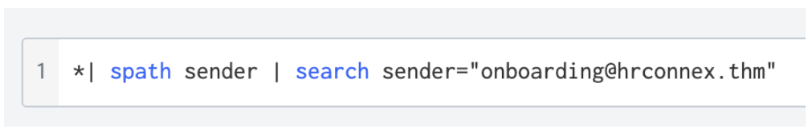
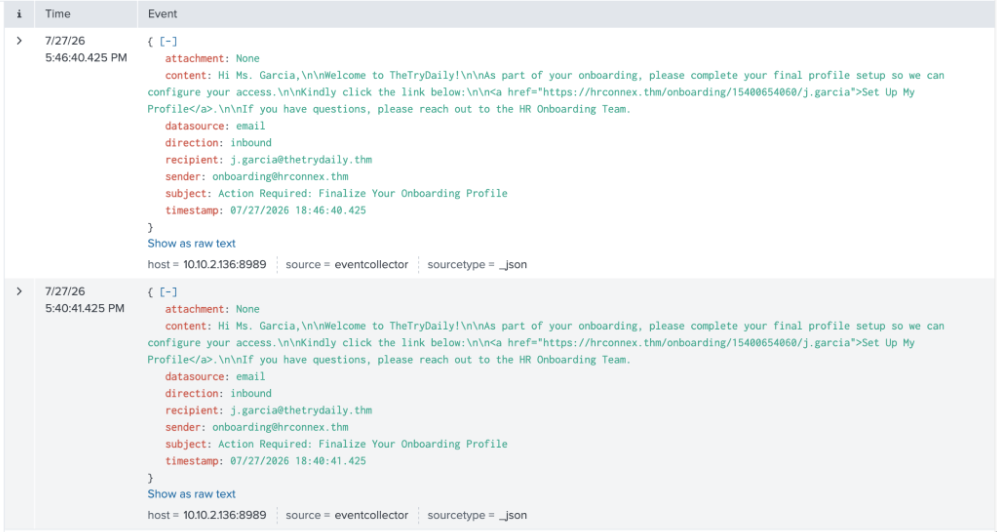
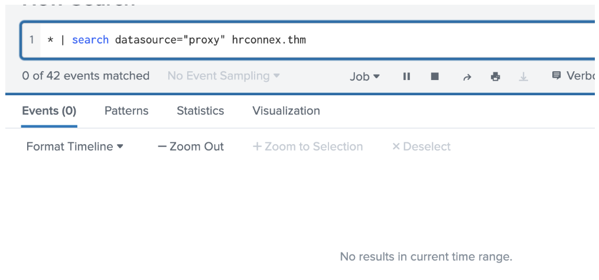
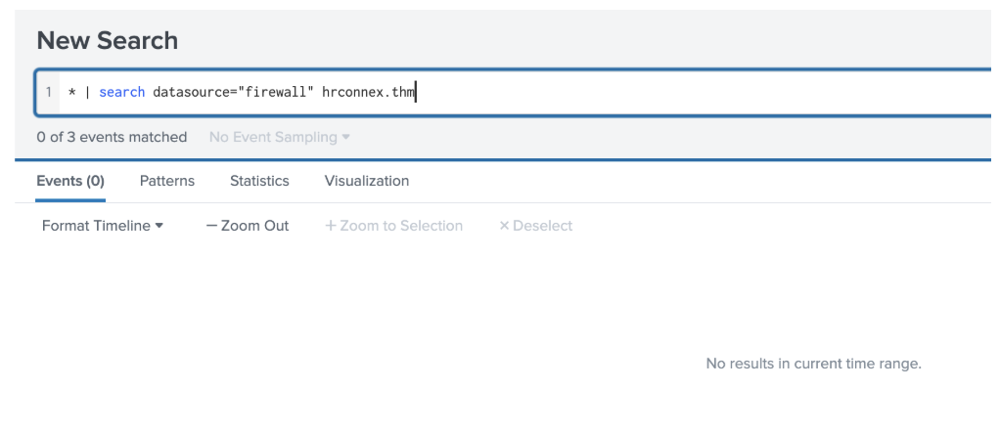

# 8814 - Inbound Email Containing Suspicious External Link (HR Impersonation)

## Alert Details

<h3>🕣 Time & Date of the activity:</h2>
Time of Alert: 27/07/2026 5:40 pm

<h3>🖥️ List of affected entities:</h3>

- j.garcia@thetrydaily.thm - recipient of the phishing email
- j.garcia's endpoint/workstation - no connection attempts to hrconnex.thm 
  identified in proxy/firewall logs; no evidence this entity was compromised

<h3>🧐 Investigation Steps Taken:</h3>

1. Reviewed the email content and headers — the sender domain (hrconnex.thm) 
   does not match the recipient's organisational domain (thetrydaily.thm), 
   and the email uses urgency-based social engineering language 
   ("Action Required").

2. Searched Splunk SIEM email logs for the domain hrconnex.thm — found the 
   same phishing email was sent to j.garcia 2 separate times within 6 
   minutes (17:40, 17:46), indicating a repeated phishing attempt rather 
   than a one-off email.

3. Searched proxy and firewall logs for hrconnex.thm - no matching events 
   found, even after expanding the time range. This confirms no endpoint 
   attempted to access the malicious URL.

<h3>🕵️‍♂️ Evidence</h3>

<h4>Screenshot 1</h3>

<h4>Screenshot 2</h3>

Screenshot 1 shows the query used to output the two logs shown in the Screenshot 2. These email logs show the two emails received by j.garcia@thetrydaily.thm within 6 minutes of each other. 

<h4>Screenshot 3</h3>

 

<h4>Screenshot 4</h3>

 

Screenshot 3 & 4 show there were no proxy or firewalls logs assocaited with the domain hrconnex.thm. 

