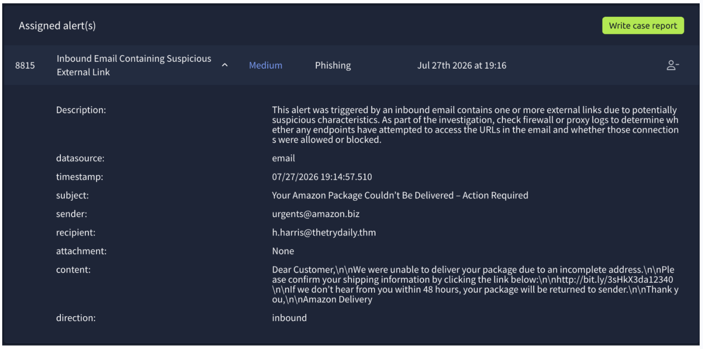
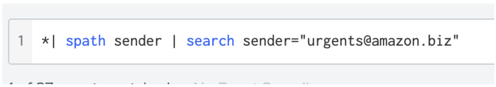
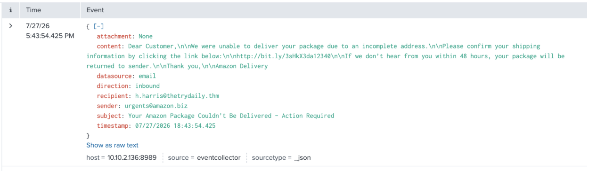
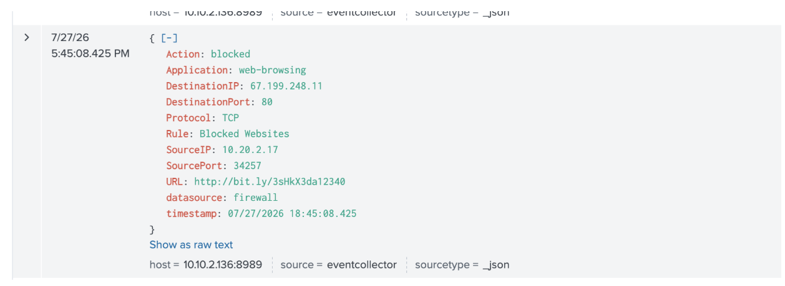

# 8815 - Inbound Email Containing Suspicious External Link (Amazon Impersonation)

## Alert Details

<h3>🕣 Time & Date of the activity:</h2>
Time of Alert: 27/07/2026 5:43 pm

<h3>🖥️ List of affected entities:</h3>

- h.harris@thetrydaily.thm — recipient of the phishing email
- h.harris's endpoint/workstation — proxy and firewall logs showed a 
  connection attempt to the suspicious link (http://bit.ly/3sHkX3da12340) 
  from source IP 10.20.2.17 (Hannah Harris's workstation). The connection 
  was blocked by the firewall.

<h3>🧐 Investigation Steps Taken:</h3>

1. Reviewed the email content and headers — sender domain amazon.biz is not 
   an official Amazon domain (legitimate Amazon domains are amazon.com and 
   regional variants). The link within the email is an unencrypted HTTP 
   link (http://bit.ly/3sHkX3da12340), which is a further indicator the 
   link is unsafe.

2. Noted urgency tactics used in the email content — a "48 hour deadline" 
   and "Action Required" language — along with a shortened URL (bit.ly), 
   which obscures the true destination.

3. Searched Splunk SIEM email logs for the domain amazon.biz — only one 
   email was found sent from this domain to h.harris@thetrydaily.thm, at 
   17:43.

4. Searched proxy and firewall logs for http://bit.ly/3sHkX3da12340 — the 
   link was accessed from source IP 10.20.2.17 at 17:45, less than 2 
   minutes after the email was received. However, the connection was 
   blocked by the firewall, preventing Hannah from reaching the malicious 
   website.

<h3>🕵️‍♂️ Evidence</h3>

<h4>Screenshot 1</h4>

<h4>Screenshot 2</h4>

Screenshot 1 shows the query used to output the logs shown in Screenshot 2. This email log shows the email received by h.harris@thetrydaily.thm. 

<h4>Screenshot 3</h4>

Screenshot 3 shows the firewall log blocking access to http://bit.ly/3sHkX3da12340

<h3>🫡 Final Verdict:</h3>
True Positive. No escalation required, as the malicious connection was 
successfully blocked and there is no evidence the recipient or any other 
entity was able to access the link.

<h3>❗️ Recommended Remediation Actions:</h3>

- Block sender domain amazon.biz and the shortlink bit.ly/3sHkX3da12340 
  at the email gateway/proxy
- Notify h.harris of the phishing attempt and confirm no further action 
  was taken on her end
- Continue monitoring for similar Amazon-themed phishing emails targeting 
  other recipients

