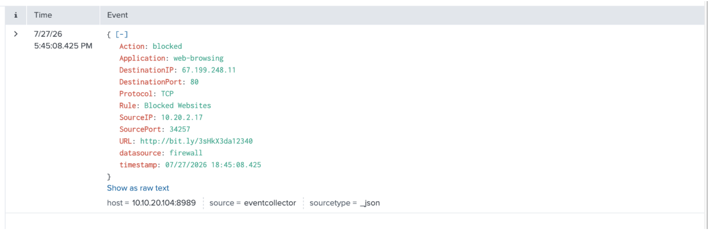
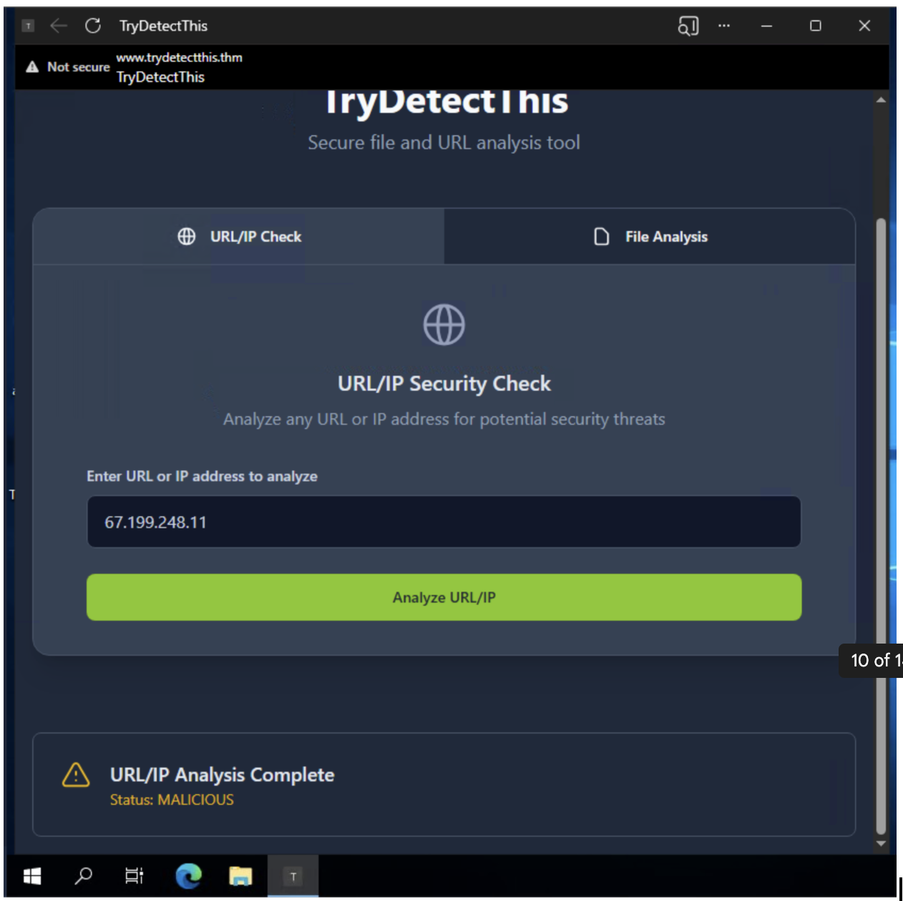
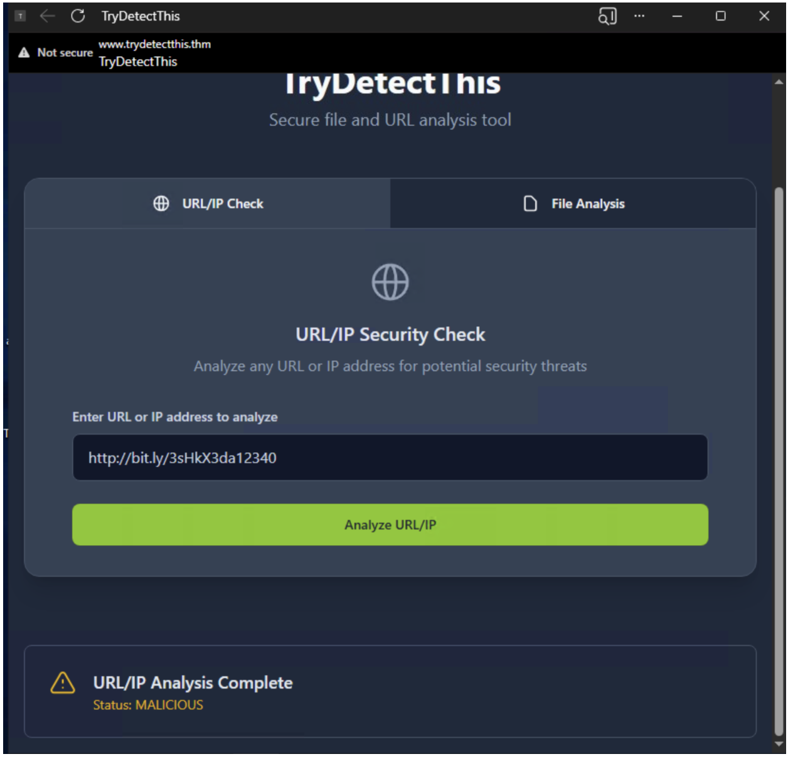

# 8816 - Access to Blacklisted External URL Blocked by Firewall 

## Alert Details

<h3>🕣 Time & Date of the activity:</h2>
Time of Alert: 27/07/2026 5:45 pm

<h3>🖥️ List of affected entities:</h3>

- 10.20.2.17 (Source IP) - This is the IP that accessed the link (http://bit.ly/3sHkX3da12340), associated with Hannah Harris. However, the firewall blocked the connection.

<h3>🧐 Investigation Steps Taken:</h3>

1. Searched proxy and firewall logs for the link (http://bit.ly/3sHkX3da12340) 
   to check whether any other IPs attempted to access the URL. No other 
   logs were found, indicating no other IP tried to access this link.

2. Noted that the link uses an HTTP URL, an unencrypted protocol commonly 
   used by malicious actors to serve phishing pages. I also ran the 
   TryDetectThis Scan, which confirmed the link as malicious.

<h3>🕵️‍♂️ Evidence</h3>

<h4>Screenshot 1</h4>

Screenshot 1 shows the firewall log blocking access to http://bit.ly/3sHkX3da12340

<h4>Screenshot 2</h4>

<h4>Screenshot 3</h4>

Screenshots 2 & 3 show the TryDetectThis scan result of the malicious link (http://bit.ly/3sHkX3da12340)

<h3>🫡 Final Verdict:</h3>
True Positive. No escalation required, as there is no evidence showing 
the source IP or any other IP was able to access the link.

<h3>❗️ Recommended Remediation Actions:</h3>
- Continue to block the URL http://bit.ly/3sHkX3da12340
- Hannah Harris requires training to detect suspicious emails

