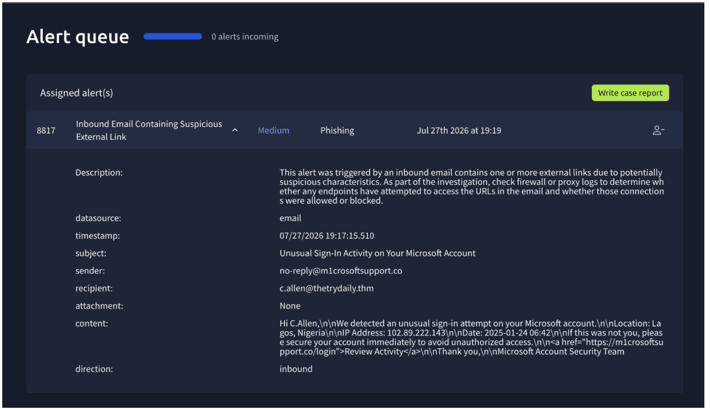
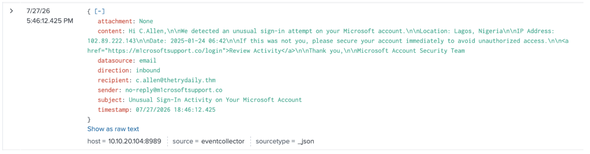
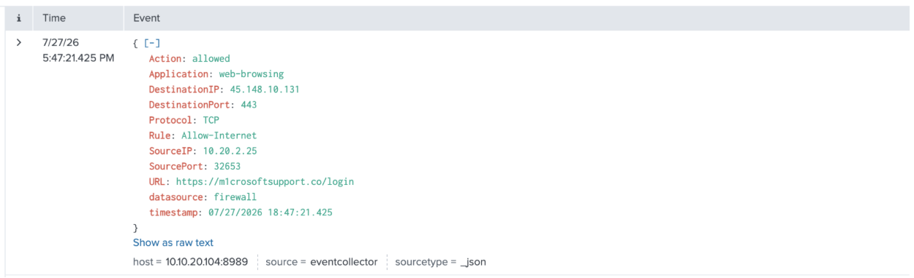

# 8817 - Inbound Email Containing Suspicious External Link (Microsoft Support Impersonation)

## Alert Details

<h3>🕣 Time & Date of the activity:</h2>
Time of Alert: 27/07/2026 5:46 pm

<h3>🖥️ List of affected entities:</h3>

- c.allen@thetrydaily.thm — recipient of the phishing email
- c.allen's endpoint/workstation — proxy and firewall logs showed a 
  connection attempt to the suspicious link (https://m1crosoftsupport.co/login) 
  from source IP 10.20.2.25, which is c.allen's (Charlotte Allen's) IP 
  address. This connection was allowed.

<h3>🧐 Investigation Steps Taken:</h3>

Investigation Steps Taken:

1. Reviewed email content — sender domain m1crosoftsupport.co uses the 
   numeral "1" in place of the letter "i" to imitate "Microsoft", a 
   typosquatting technique. This is not a legitimate Microsoft domain 
   (official domains are microsoft.com, live.com, outlook.com, etc.).

2. Noted social engineering tactics used in the email, including fear-based 
   urgency (an "unusual sign-in" allegedly from Lagos, Nigeria) and 
   fabricated technical details (IP address, date/time) intended to make 
   the alert appear legitimate.

3. Searched SIEM email logs for m1crosoftsupport.co - there were no other 
   emails sent to employees from this domain.

4. Searched SIEM proxy/firewall logs for m1crosoftsupport.co — only one IP 
   (10.20.2.25, the email recipient's) attempted to access 
   https://m1crosoftsupport.co/login at 18:46. This 
   connection was allowed.

<h3>🕵️‍♂️ Evidence</h3>

<h4>Screenshot 1</h4>

<h4>Screenshot 2</h4>

